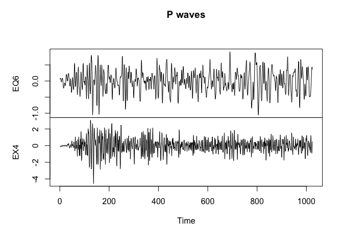
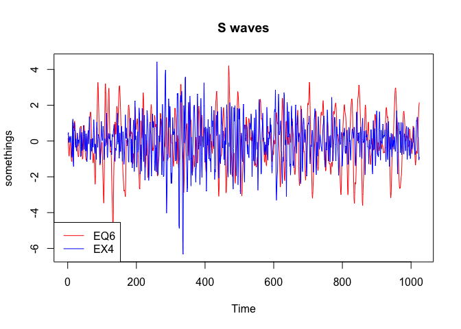
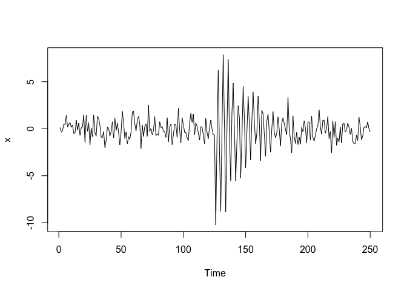
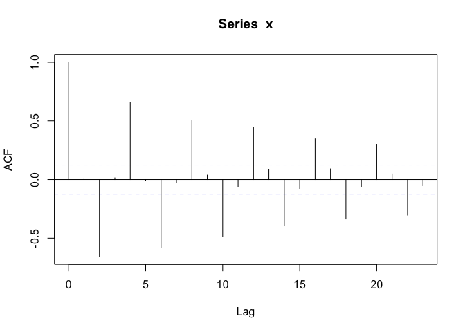

Discussion 1
================
Po
10/6/2020

# Logistics

Name: Chi Po Choi

Email: `cpchoi@ucdavis.edu`

Office Hours: Tuesday 12noon-ish \~ 1pm-ish, Thursday 12noon-ish \~
1pm-ish

# R time series landscape

There are a lots of R functions and R packages for time series analysis.

Time-Series Objects

``` r
?ts
```

[CRAN Task View: Time Series
Analysis](https://cran.r-project.org/web/views/TimeSeries.html)

# Data in textbook

The *Chapman\&Hall textbook* **Time Series: A Data Analysis Approach
Using R** and the *Springer textbook* **Time Series Analysis and Its
Applications** has a companion R package `astsa` which contains time
series data illustrated. <https://github.com/nickpoison/astsa>

Install it and get the data.

``` r
# In case you haven't install devtools
# install.packages("devtools")
devtools::install_github("nickpoison/astsa")
```

For example, `eqexp` is

``` r
?astsa::eqexp
```

> This is a data frame of the earthquake and explosion seismic series
> used throughout the text.

``` r
head(astsa::eqexp)
```

    ##             EQ1         EQ2         EQ3         EQ4         EQ5         EQ6
    ## 1  0.0008177611 -0.20803371 -0.02099650 -0.06426190  0.13468746  0.05088054
    ## 2  0.0338007934  0.03031875 -0.04199301 -0.01623459  0.08698565  0.07696279
    ## 3  0.0166278096  0.09904929 -0.06816470 -0.08590802  0.11616794  0.08217421
    ## 4  0.0046339797  0.20335303 -0.06786898 -0.09876040  0.11336195  0.05881095
    ## 5 -0.0365266638  0.54078497 -0.03445201 -0.04058647  0.04882421  0.01374605
    ## 6 -0.0250780080  0.47459106  0.00768886 -0.05546817 -0.02020312 -0.02311150
    ##            EQ7         EQ8          EX1        EX2          EX3          EX4
    ## 1 -0.019261602 -0.02191642  0.041018279 0.04261683 -0.008052985 -0.073001923
    ## 2 -0.020046594 -0.25266506  0.030043488 0.02639699 -0.001921735 -0.094665095
    ## 3 -0.011505410 -0.17157429  0.023732984 0.02576092 -0.011164366 -0.114399354
    ## 4 -0.025916462 -0.14402221  0.012895379 0.03371182 -0.018302239 -0.090807270
    ## 5 -0.026068774 -0.31966669  0.002606513 0.01494769 -0.013086101 -0.031010979
    ## 6 -0.004991145 -0.31684887 -0.007133614 0.01812805 -0.004941605 -0.005193226
    ##           EX5          EX6         EX7       EX8          NZ
    ## 1 -0.11064984 -0.027236460 -0.05632693 0.2007165  0.36283033
    ## 2 -0.09818830 -0.009590303 -0.08507248 0.2416032  0.33815558
    ## 3 -0.07809945 -0.033374254 -0.11131062 0.3072697  0.01465292
    ## 4 -0.06424136 -0.006137794 -0.10387797 0.3233766 -0.36930248
    ## 5 -0.04823474 -0.011891975 -0.08256508 0.2093894 -0.38343611
    ## 6 -0.05285410 -0.021098666 -0.06653563 0.0396477 -0.15417118

``` r
str(astsa::eqexp)
```

    ## 'data.frame':    2048 obs. of  17 variables:
    ##  $ EQ1: num  0.000818 0.033801 0.016628 0.004634 -0.036527 ...
    ##  $ EQ2: num  -0.208 0.0303 0.099 0.2034 0.5408 ...
    ##  $ EQ3: num  -0.021 -0.042 -0.0682 -0.0679 -0.0345 ...
    ##  $ EQ4: num  -0.0643 -0.0162 -0.0859 -0.0988 -0.0406 ...
    ##  $ EQ5: num  0.1347 0.087 0.1162 0.1134 0.0488 ...
    ##  $ EQ6: num  0.0509 0.077 0.0822 0.0588 0.0137 ...
    ##  $ EQ7: num  -0.0193 -0.02 -0.0115 -0.0259 -0.0261 ...
    ##  $ EQ8: num  -0.0219 -0.2527 -0.1716 -0.144 -0.3197 ...
    ##  $ EX1: num  0.04102 0.03004 0.02373 0.0129 0.00261 ...
    ##  $ EX2: num  0.0426 0.0264 0.0258 0.0337 0.0149 ...
    ##  $ EX3: num  -0.00805 -0.00192 -0.01116 -0.0183 -0.01309 ...
    ##  $ EX4: num  -0.073 -0.0947 -0.1144 -0.0908 -0.031 ...
    ##  $ EX5: num  -0.1106 -0.0982 -0.0781 -0.0642 -0.0482 ...
    ##  $ EX6: num  -0.02724 -0.00959 -0.03337 -0.00614 -0.01189 ...
    ##  $ EX7: num  -0.0563 -0.0851 -0.1113 -0.1039 -0.0826 ...
    ##  $ EX8: num  0.201 0.242 0.307 0.323 0.209 ...
    ##  $ NZ : num  0.3628 0.3382 0.0147 -0.3693 -0.3834 ...

# Plotting time series

``` r
p_index = 1:1024
time_series_name = c("EQ6", "EX4")
time_series_to_be_plotted = astsa::eqexp[p_index, time_series_name]
plot.ts(time_series_to_be_plotted,
        plot.type = "multiple",
        nc = 1,
        main = "P waves")
```

<!-- -->

``` r
s_index = p_index+1024
colors_name = c("red", "blue")
time_series_to_be_plotted = astsa::eqexp[s_index, time_series_name]
plot.ts(time_series_to_be_plotted,
        plot.type="single",
        main="S waves",
        col=colors_name,
        ylab="somethings")
legend("bottomleft",
       time_series_name,
       col=colors_name,
       lty=1)
```

<!-- -->

Plotting Time-Series Objects

``` r
?plot.ts
```

R knowledge question: Do you know what are the differences among those
calls?

  - `plot.ts(x)`
  - `plot(ts(x))`
  - `plot(x)`
  - `plot.ts(ts(x))`

# Simulating time series


where


``` r
s_fun = function(t) ifelse(t<=125, 0, 10*exp(-(t-125)/25)*cos(2*pi*t/4))
omega_fun = function(t) rnorm(length(t))

t_index = 1:250
set.seed(19460614)
x = ts(s_fun(t_index) + omega_fun(t_index))
```

``` r
str(x)
```

    ##  Time-Series [1:250] from 1 to 250: 0.13 -0.383 -0.192 0.515 0.441 ...

``` r
plot(x)
```

<!-- -->

``` r
acf(x)
```

<!-- -->

``` r
str(acf(x, plot=F))
```

    ## List of 6
    ##  $ acf   : num [1:24, 1, 1] 1 0.0101 -0.6564 0.0142 0.6559 ...
    ##  $ type  : chr "correlation"
    ##  $ n.used: int 250
    ##  $ lag   : num [1:24, 1, 1] 0 1 2 3 4 5 6 7 8 9 ...
    ##  $ series: chr "x"
    ##  $ snames: NULL
    ##  - attr(*, "class")= chr "acf"

# Summary

  - `?`
  - `str`
  - `ts`
  - `plot.ts`
  - `acf`
